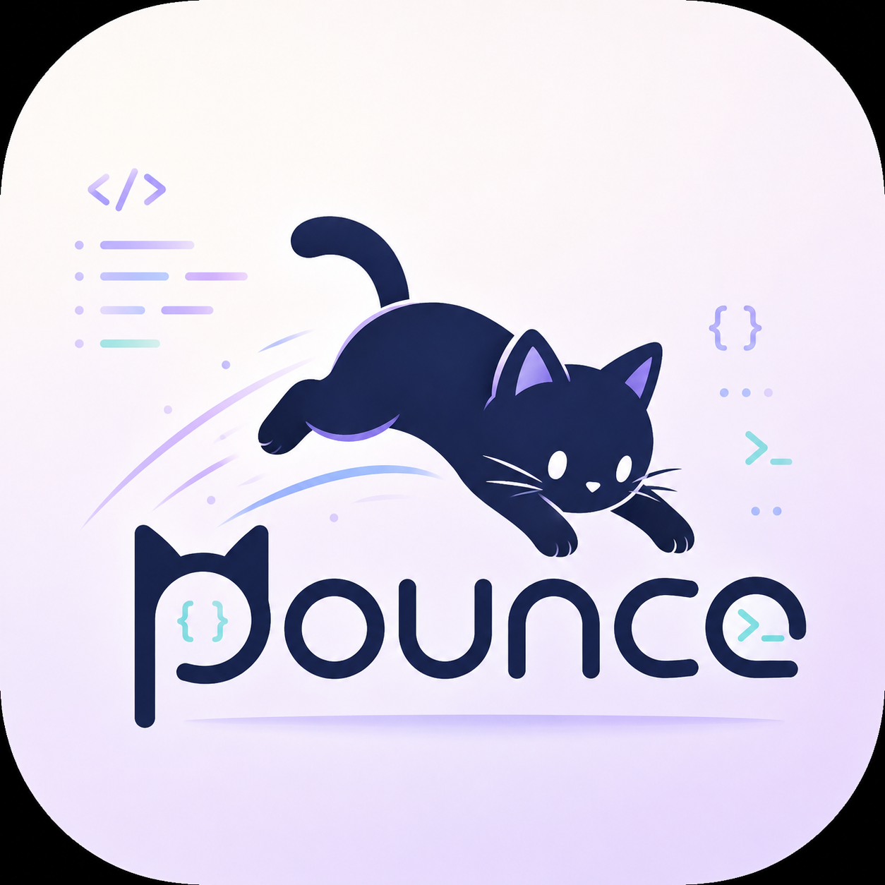

<div align="center">
  
  <h1>Pounce</h1>
  <p><b>Control your coding agents from your pocket.</b></p>
  <p>
    <a href="https://peppyhop.github.io/pounce/">Website</a> ·
    <a href="https://github.com/peppyhop/pounce/releases/latest">Download Mac Bridge</a> ·
    <a href="#getting-started-dev">Dev setup</a>
  </p>
</div>

---

Pounce lets you steer **Claude, Codex & opencode** across every machine you own — from
your phone. Watch agents work in real time, jump in by voice, review diffs, and ship,
all one‑handed.

This is the full open‑source monorepo: the mobile app, the desktop Bridge, the bridge
server, the shared packages, and the landing page.

## Repo layout

| Path | What |
|---|---|
| `apps/mobile` | The Pounce **Expo / React Native** app (iOS & Android) |
| `apps/bridge` | The **bridge server** (`server.mjs`) — re‑exposes the Iroh‑only agent host over LAN HTTP for the app |
| `bridge-desktop` | The **macOS Bridge app** ([Electrobun](https://electrobun.dev)) — double‑click, shows a pairing QR, runs the agent host |
| `packages/nitro` | Native **Iroh** client (Rust + Nitro) for direct device‑to‑device sync |
| `packages/{shared,runtime,ui}` | Shared types, runtime/transport, and UI primitives |
| `docs/` | The landing page (served via GitHub Pages) |
| `scripts/` | Release + host install helpers |

## How it works

Your agents run behind an Iroh‑based daemon (the *agent host*) that a phone can't reach
directly. The **Bridge** runs on your computer: it starts the host, exposes a small
token‑protected HTTP surface on your LAN, and shows a QR. The **app** scans it once and
syncs — then keeps a direct identity to reach your machine afterward.

## Get the app

- **Mac Bridge:** download the signed + notarized `.dmg` from
  [**Releases**](https://github.com/peppyhop/pounce/releases/latest) — open it, drag to
  Applications, launch, scan the QR.
- **iOS / Android:** in private beta — see the [website](https://peppyhop.github.io/pounce/).

## Getting started (dev)

Prereqs: [Bun](https://bun.sh), Xcode (iOS) / Android Studio, and the `kittylitter`
agent host running.

```bash
bun install                       # install the workspace (apps/* + packages/*)

# Mobile app
cd apps/mobile && bun run ios     # or: bun run android

# Bridge server (standalone CLI)
node apps/bridge/server.mjs

# Desktop Bridge app (isolated — not part of the bun workspace)
cd bridge-desktop && bun install && bun run dev
```

### Releasing the Bridge

```bash
bash scripts/release-bridge.sh ~/Downloads/<your-DeveloperID>.cer
```

Builds, signs, notarizes (via the `asc` CLI), staples, and cuts a GitHub Release.
CI does the same on a `bridge-v*` tag — see
[`.github/workflows/release-bridge.yml`](.github/workflows/release-bridge.yml).

## License

MIT
